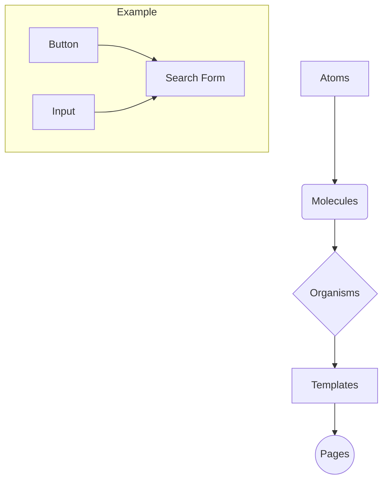

# {frontmatter.title}

<p class="mt-4 text-lg text-muted-foreground">{frontmatter.description}</p>

## Why it exists

The Atomic Design methodology was introduced by Brad Frost to address the challenge of building and maintaining consistent user interfaces, especially in large, complex applications. As projects grow, inconsistencies in UI elements (buttons, inputs, colors) can creep in, leading to a fragmented user experience and a codebase that's difficult to manage. 

This pattern provides a structured way to think about UI components, breaking them down into their most basic elements (atoms) and progressively composing them into more complex organisms and templates. This creates a clear hierarchy, promotes reusability, and ensures visual consistency across the entire application.

## When to avoid

- **Very Simple Projects:** For small websites or applications with only a handful of unique UI components, the overhead of setting up and maintaining an atomic structure might be more effort than it's worth. A simpler component organization might suffice.
- **Rapid Prototyping:** When the primary goal is to quickly build a proof-of-concept and the UI is expected to change drastically, enforcing a strict atomic hierarchy can slow down the initial development process.
- **Teams Unfamiliar with the Concept:** Rolling out Atomic Design requires team buy-in and understanding. If the team is not willing to invest time in learning and adopting the methodology, it can lead to confusion and improper implementation.

## Code snippet

Here's a simplified example of how atoms can be composed into a molecule in a React/TSX context.

```tsx
// Atom: /components/atoms/Button.tsx
export const Button = ({ children, onClick }) => (
  <button 
    onClick={onClick}
    className="bg-blue-500 hover:bg-blue-700 text-white font-bold py-2 px-4 rounded"
  >
    {children}
  </button>
);

// Atom: /components/atoms/Input.tsx
export const Input = ({ value, onChange, placeholder }) => (
  <input
    type="text"
    value={value}
    onChange={onChange}
    placeholder={placeholder}
    className="shadow appearance-none border rounded py-2 px-3 text-gray-700 leading-tight focus:outline-none focus:shadow-outline"
  />
);

// Molecule: /components/molecules/SearchForm.tsx
import { Button } from '../atoms/Button';
import { Input } from '../atoms/Input';

export const SearchForm = ({ onSearch }) => {
  // state management logic...
  return (
    <form onSubmit={onSearch} className="flex items-center gap-2">
      <Input placeholder="Search..." />
      <Button>Search</Button>
    </form>
  );
};
```

## Mermaid diagram

This diagram illustrates the composition flow from atoms to pages.



## Live demo link

For a comprehensive look at Atomic Design in action, check out Brad Frost's official example:
- **[Pattern Lab](https://patternlab.io/)**

## TL;DR

- **Builds from small to large:** Starts with basic HTML tags (atoms) and composes them into reusable components.
- **Promotes consistency:** Ensures a cohesive look and feel by reusing the same base elements everywhere.
- **Creates a scalable system:** Makes it easier to manage and update the UI as the application grows.
- **Not for every project:** Can be overkill for small sites or rapid prototypes. 