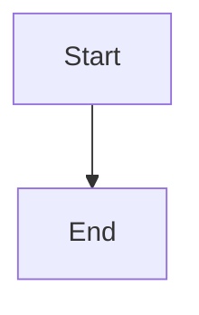

# {frontmatter.title}

<p class="mt-4 text-lg text-muted-foreground">{frontmatter.description}</p>

## Why it exists

(Write the problem this pattern solves)

## When to avoid

(Write when you should not use this pattern)

## Code snippet

```tsx
// Your code here
```

## Mermaid diagram



## Live demo link

- **[Link to Demo](https://example.com)**

## TL;DR

- Point 1
- Point 2
- Point 3
